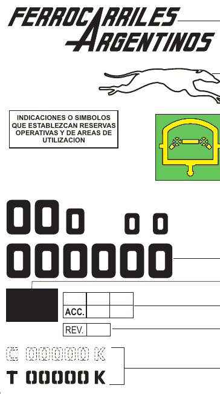

# FA freight cars: reference

Load limits, tares and markings of Ferrocarriles Argentinos broad-gauge
(1676 mm) freight cars, for the game's cars. Researched 2026-10-08 (#18, #54).

**Decided (Tom):**
- **Car marks: both kinds** (2026-10-08, #54). Most cars carry FA's
  unified panel (monogram and type code); a few not yet repainted keep
  their line's initials. The share is retunable.

**Status:** load limits, some tares, the numbering, the marking layout and
the paint colours are **Confirmed**, read on FA's own technical
specifications (FAT) and drawings (NEFA), hosted by CNRT. **Lengths over
couplers are still not found**: the general-arrangement drawings the FATs
point to (NEFA 254, 32.000 and the like) aren't on CNRT's site, and only
detail sheets are. Open gap: lengths, in #54.

## Load limits and tares

| Kind | Load limit | Tare | Source | Status |
|---|---|---|---|---|
| Vagón borde alto (high-side gondola) | 60 t | at most 20.0 t ± 0.2, bogies included | FAT V-1529, July 1977 | Confirmed |
| Vagón borde alto, broad and standard gauge | 59 t | — | FAT V-1527, May 1975 (CNRT's index lists it as 50 t; the document says 59) | Confirmed |
| Tolva granero (grain hopper) | 58 t | — | FAT V-1539 (title, on CNRT's index) | Confirmed |
| Tolva cubierta para cereal a granel | 50 t | — | FAT V-1500 (title) | Confirmed |
| Tolva para cemento a granel | 60 t | — | FAT V-1519, June 1974 | Confirmed |
| Tolva pedrero (ballast hopper) | 59 t | body 13.4 t, without bogies | FAT V-1530, May 1987 | Confirmed |
| Plataforma for three 20 ft (1C) containers | 61 t | at most 19.0 t, bogies included | FAT V-1520, December 1989 | Confirmed |
| Vagón mixto, rails and containers | — | 19.5 t ± 0.5, two bogies of about 4.25 t each | FAT V-1545, October 1981 | Confirmed |
| Vagón tanque | 60 m³ tank | — | FAT V-1548 (title: frame for a 60 m³ tank) | Confirmed |
| Vagón cubierto todo uso, broad gauge | 50 t | — | A web search summary of the NEFA drawing index; not seen on the page | Unconfirmed |

A broad-gauge bogie, as used under these cars, weighs about 4.25 t (FAT
V-1545), so a bogie car's tare is its body plus about 8.5 t.

## Numbering and marking

From FAT MRe-2002, "Marcado unificado de vehículos de carga", June 1988,
which applies the March 1971 recoding and renumbering of FA's wagons.
**Confirmed**.

- **An 11-digit code**, painted in two rows of six columns:
  - first row: **type** and **sub-type** (traffic code, NEFA 958), an
    **operating** digit (speed, gauge change, rack and mountain working;
    NEFA 956), and the **mechanical class and sub-class** (metal,
    part-metal or wooden; NEFA 957);
  - second row: the **car number**, five digits, then a **check digit**.
- **Car numbers by gauge:** 1000–7999 standard (1435 mm), 8000–39999 metre
  (1000 mm), **40000–99999 broad (1676 mm)**.
- The number is also painted near the top right of both ends, and punched
  into the frame's right-hand ends.
- A card holder for the **destination card** (ficha de destino) sits on the
  side (NEFA 410).
- **Colours:** FAT V-1520 (1989) gives a **black frame** and **white
  lettering**. Body colours per car kind are in NEFA 560 (tank cars), 561
  (box cars) and 562 (open cars), unread.
- The numbers' shapes and the standard letters are NEFA 938 and 674; the
  layout per kind is NEFA 543 (box), 544 (high side), 547 (tank), 548
  (flat).

### Type codes (NEFA 958, read 2026-10-08)

The first two digits of the code's top row: **type**, then **sub-type**.
Confirmed, NEFA 958 issue 12 (1992). The kinds the game uses:

| Type | Kind | Sub-types that matter here |
|---|---|---|
| 1 | Cubierto, carga general, no grain hatch | 0–6 by load: up to 19 t … 6 = over 50 t |
| 2 | Cubierto, carga general, grain hatch | 0–6 by load; **7, 8, 9 = vagón para ganado** (one deck, two decks, convertible) |
| 3 | Cubierto granero | 0–6 by load (6 = 50 t and over) |
| 5 | Abierto | 0–4 costados fijos altos by load (3 = 40–50 t, 4 = over 50 t); 5–8 costados bajos |
| 6 | Plataforma | 0–3 by headstock and 12.5 m length; 4 = two containers, 8 = three containers |
| 7 | Tolva | 0 cemento; 1–3 piedras; 4 granero convertible; 5 graneros |
| 8 | Tanque | 0 petróleo y fuel-oil; 1 nafta y kerosene; 2 gas oil y diesel oil; 6 agua |
| 9 | Tanque | 0 aceites vegetales; 6 vinos y jugos |
| 0 | Servicio interno | 7 = vagón de cola |

So a **jaula (stock car) is a type 2 cubierto in FA's code**, sub-type 7–9,
not a kind of its own. Examples: a 60 t borde alto is **54**, a 58 t tolva
granero **75**, a 50 t covered car with a grain hatch **26**, a gasoil tank
**82**.

The third digit (NEFA 956) is the operating code: **3** is plains, low
speed; **2** plains, high speed (the galgo, greyhound, symbol); 0–1 are
privately owned. The fifth and sixth digits (NEFA 957) are the mechanical
class: metal, part-metal or wooden body, and the bogie and bearing type.
The fourth column of the top row is left blank (NEFA 553).

### The side panel (NEFA 555, 553, 771)

*NEFA 555, CNRT copy, cropped.* Confirmed. At the right-hand end of each
side, top to bottom:

1. **The FERROCARRILES ARGENTINOS monogram** (NEFA 485). **No line
   initials:** the unified marking of 1976 (NEFA 555 issue 3) and MRe-2002
   put FA's monogram at the top of the panel. A car got it when next
   repainted (MRe-2002 D-1), so in the late 1970s and 80s cars with old
   line marks and cars with the FA panel likely ran together (my
   inference, not read anywhere).
2. The **greyhound** (NEFA 487) on cars passed for high speed.
3. Symbols for operating restrictions, and the **brake symbol** (NEFA
   532–539: vacuum, air, or through pipe only).
4. **The code**: top row type, sub-type, operating digit, blank, mechanical
   class; bottom row the five-digit car number and the check digit, 180 mm
   high (NEFA 553).
5. Damage-label panel (NEFA 549), repair grid **ACC.** and **REV.** (550,
   940).
6. **C 000000 K** and **T 00000 K**, 63.5 mm high (NEFA 771): the tare in
   kilograms, rounded to the nearest 50 kg, weighed in the shops with the
   car uncoupled; optionally followed by the month and year as the tare's
   expiry. C is drawn dashed above it. That C is the load limit in kilograms
   is my reading; the drawing doesn't say.
7. The destination-card holder (NEFA 410).

So a stencil reads, for example, **T 20000 K** and **C 060000 K**.

### Paint (NEFA 560, 561, 562)

Colours to IRAM DEF D10-54. Confirmed. Lines didn't differ: these are
FA-wide.

| Kind | Body | Frame | Lettering | Other |
|---|---|---|---|---|
| Cubierto, general | grey 09-1-140, roof grey | grey | white | |
| Cubierto granero only | grey | grey | white | yellow triangles |
| Hacienda (stock) | grey | grey | white | two boards white |
| Abierto (borde alto) | grey 09-1-140 | grey | white | |
| Plataforma for containers or bulk cement | yellow 05-1-070 | black | black | yellow floor |
| Tanque, gasoil, diesel, kerosene | black 11-1-070 | black | white | yellow band, black dome |
| Tanque, petróleo, asfalto | black | black | white | black band and dome |
| Tanque, nafta, solvents | white 11-1-010 | black | black | white band and dome |
| Tanque, agua | grey | black | white | grey band and dome |

Bogies black, brake wheels white on all of them. Private-owner cars blue
08-1-080 with white lettering. FAT V-1520 (1989) gives the container flat a
black frame and white lettering; NEFA 562 (issue 8) gives yellow body,
black frame and black lettering.

## Couplers and buffers

FAT V-1527 and V-1529 give the borde alto **side buffers 1850–1860 mm
apart** and a **screw coupling** on the central draw hook, with brackets
for a future automatic coupler. Confirmed. Broad-gauge FA cars of the
period ran on buffers and screw couplings, which bears on #33.

## Length clues

No drawing found gives a length over couplers or buffers. What was found:

- **Tolva pedrero, broad gauge** (NEFA 32.060): side sill **10.43 m**.
  Confirmed. Over buffers is longer by the headstocks and buffers; about
  11.5–12 m, Unconfirmed.
- **Tanque monocasco** (NEFA 25.015): frame **12.7 m**, but the sheet
  gives no gauge, and FA's monocoque tank spec is metre gauge (V-1528), so
  it isn't applied here.
- **Container flat**: three 20 ft (6.06 m) containers, so at least 18.2 m
  of deck. Derived.

Would confirm the rest: NEFA 254 (V-1529's general arrangement), NEFA
32.000 (V-1530's), or a photo of a car's length stencil.

## In the game

What `index.html` uses, and where it comes from. **Estimated** values are
Unconfirmed and retunable.

| Kind | Length over couplers | Tare | Load limit |
|---|---|---|---|
| Vagón cubierto | 15.5 m, estimated | 21 t, estimated | 50 t, Unconfirmed (above) |
| Tolva cerealera | 15 m, estimated | 21 t, estimated | 58 t, FAT V-1539 |
| Borde alto | 14 m, estimated | 20 t, FAT V-1529 | 60 t, FAT V-1529 |
| Plataforma | 19.5 m, estimated from three 6.06 m containers | 19 t, FAT V-1520 | 61 t, FAT V-1520 |
| Vagón tanque | 14 m, estimated | 21 t, estimated | 50 t: 60 m³ of gasoil at about 0.84 t/m³, derived |

- A loaded car carries its full load limit, so a loaded car weighs 71–80 t
  and an empty one 19–21 t. The game's earlier box cars were 60 t loaded
  and 25 t empty, the figures in [train-physics.md](train-physics.md)'s
  worked example.
- Cars carry the initials of one of the four broad-gauge lines (FCGSM,
  FCDFS, FCGBM, FCGR); Junín is San Martín, so most are FCGSM. Which
  numbers go to which kind is the game's, not FA's.

**Where the game and FA disagree** (fixing them is Tom's call, #54):

- **Line initials.** FA's unified marking carries the FA monogram, not the
  line's initials (NEFA 555). Tom chose both (above); #55 shows initials
  on every car.
- **Body colours.** The game's cubierto and borde alto are brown; FA's
  are grey 09-1-140. The gasoil tank is black with a yellow band in FA's
  scheme; the game's is grey.
- **No type code.** The game could show the top row too, for example
  **54 3** over **71842 x** for a 60 t borde alto. The check digit's
  formula wasn't found.

## Sources

- [Especificaciones FAT, CNRT](https://www.argentina.gob.ar/cnrt/especificaciones-fat): the index of FA's technical specifications, with titles and capacities.
- [FAT V-1520](https://www.argentina.gob.ar/sites/default/files/normas_fat/FAT_V_1520.pdf), [FAT V-1527](https://www.argentina.gob.ar/sites/default/files/normas_fat/FAT_V_1527.pdf), [FAT V-1529](https://www.argentina.gob.ar/sites/default/files/normas_fat/FAT_V_1529.pdf), [FAT V-1530](https://www.argentina.gob.ar/sites/default/files/normas_fat/FAT_V_1530.pdf), [FAT V-1545](https://www.argentina.gob.ar/sites/default/files/normas_fat/FAT_V_1545.pdf): read 2026-10-08.
- [FAT MRe-2002, marcado unificado](https://www.argentina.gob.ar/sites/default/files/normas_fat/FAT_MRe_2002.pdf): read 2026-10-08.
- [Planos NEFA, CNRT](https://www.argentina.gob.ar/cnrt/planos-nefa): drawing titles (NEFA 543–562, 674, 938, 956–958).
- NEFA drawings, CNRT copies, read 2026-10-08: [553](https://www.argentina.gob.ar/sites/default/files/subidos_tanda_3/NEFA_553.pdf) (code), [555](https://www.argentina.gob.ar/sites/default/files/subidos_tanda_3/NEFA_555.pdf) (panel), [543](https://www.argentina.gob.ar/sites/default/files/subidos_tanda_3/NEFA_543.pdf) (box car layout), [560](https://www.argentina.gob.ar/sites/default/files/subidos_tanda_3/NEFA_560.pdf), [561](https://www.argentina.gob.ar/sites/default/files/subidos_tanda_3/NEFA_561.pdf), [562](https://www.argentina.gob.ar/sites/default/files/subidos_tanda_3/NEFA_562.pdf) (paint), [771](https://www.argentina.gob.ar/sites/default/files/subidos_tanda_3/NEFA_771.pdf) (tare), [956](https://www.argentina.gob.ar/sites/default/files/subidos_tanda_4/NEFA_956.pdf), [957](https://www.argentina.gob.ar/sites/default/files/subidos_tanda_4/NEFA_957.pdf), [958](https://www.argentina.gob.ar/sites/default/files/subidos_tanda_4/NEFA_958.pdf) (codes), [32.060](https://www.argentina.gob.ar/sites/default/files/subidos_tanda_6/NEFA_32060.pdf) (pedrero side sill), 25.015 (tank frame). The NEFA PDFs download fine with a plain request.
- V-1500, V-1501, V-1502, V-1539, V-1546, V-1547 and V-1548 didn't download (the server returned a page instead of the PDF).
