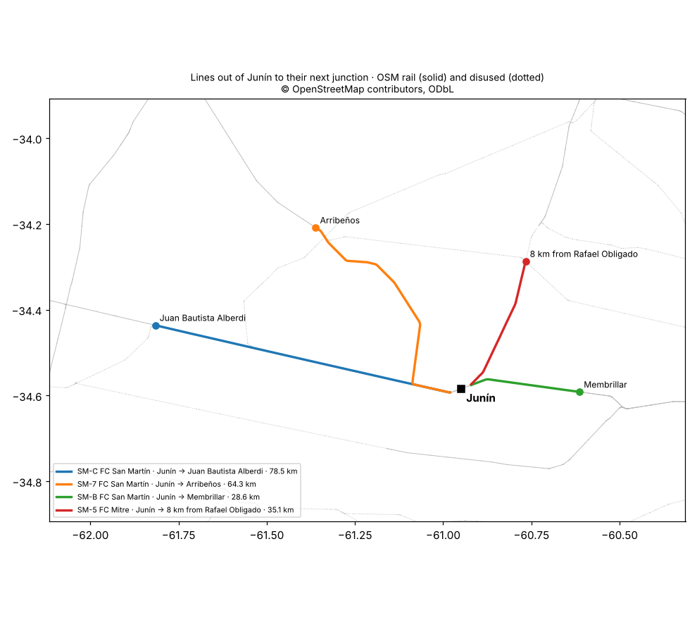

# Rail network around Junín

Researched 2026-10-08 from OpenStreetMap (#52). The yard itself is in
[junin-yard.md](junin-yard.md). Nothing here is in the game yet.

## Decided (Tom)

- **2026-10-08: "Active" means track in the FA era**: OSM `railway=rail`
  plus `railway=disused` (track still down), not `railway=abandoned`
  (track lifted). This also catches lines closed before the 1970s, so a
  line's dates are checked before it's relied on.
- **2026-10-08: Two tiers.** The network is a line graph (stations,
  junctions, distances, shape); full switching track exists only in the
  yards that are played.
- **2026-10-08: First area: every line out of Junín to its next
  junction.**
- **2026-10-08: The graph goes in WORLD DATA**, simplified, made by
  `tools/rail_network.py`, so the game stays one file. It goes in when the
  overview (#53) or main-line traffic (#56) needs it.

## The lines out of Junín

| Line (OSM `ref`, `name`) | Out of Junín | To | Length | Track | Stations on it (OSM) | Status |
|---|---|---|---|---|---|---|
| SM-C, FC San Martín | West | Juan Bautista Alberdi, where disused SM-8 leaves | 78.5 km | In use | Saforcada, Las Parvas, Blandengues, Leandro N. Alem, Vedia, Edmundo Banbury Perkins, Juan Bautista Alberdi | Secondary |
| SM-7, FC San Martín | West, then north-west at Saforcada | Arribeños, where disused SM-4 leaves | 64.3 km | In use | Saforcada, Agustina, Fortín Tiburcio, Arenales, Arribeños | Secondary |
| SM-5, FC Mitre | East, then north | A junction with disused SM-4 in Rojas partido, 8 km past Rafael Obligado | 35.1 km | Disused | Agustín Roca, Rafael Obligado | Secondary |
| SM-B, FC San Martín | East, towards Buenos Aires | Membrillar, where SM-6 leaves | 28.6 km | In use | La Oriental, O'Higgins, Membrillar | Secondary |

Source: the OpenStreetMap extract of Argentina from
download.openstreetmap.fr, data as of 2026-10-07 01:06 UTC (© OpenStreetMap
contributors, ODbL). The same refs are what OpenRailwayMap labels the lines
with. The lines' geometry and these figures are in
[rail-network-junin.geojson](rail-network-junin.geojson).

Notes on the table:

- **SM-C and SM-7 leave Junín side by side** on separate tracks and part
  at Saforcada, 10 km out. They have no connection there in OSM, so in
  the graph they are two lines from Junín, not a junction at Saforcada.
  Secondary.
- **No abandoned line** reaches Junín in OSM. Lines lifted before OSM
  mapped them may be missing altogether.

## History of the lines

Researched 2026-10-08 (#66), from Spanish Wikipedia's articles on the
lines and their stations. All Secondary: most dates there carry "citation
needed", and where two articles disagree both are given.

| Line | Real name | Built by, opened | In the 1970s–80s | Today |
|---|---|---|---|---|
| SM-B | Retiro–Junín, part of the Retiro–San Luis–Mendoza main line | Buenos Aires al Pacífico (BAP); Junín station 1884, Membrillar 1886 | Open: the BAP main line, San Martín under FA. The long-distance *Aconcagua* (Retiro–Mendoza–San Juan) ran until suspended in 1993 | Freight (Trenes Argentinos Cargas) and Retiro–Junín passenger trains |
| SM-C | Junín westward on the same main line | BAP; Saforcada station 1886 | Open, as SM-B | Freight as far as Villa Mercedes |
| SM-7 | Ramal Saforcada–Santa Isabel, 103 km | BAP, 1901–02; joined to a Mitre branch towards Rosario in 1954 | Not stated in the sources found. Unconfirmed | OSM tags it in use; Wikipedia's infobox says "no operations". They disagree |
| SM-5 | Ramal Pergamino–Junín, 88 km | Ferrocarril de la Provincia de Buenos Aires (the Oeste), reaching Junín on 3 February 1885; later Central Argentino | Open with heavy freight under FA ("more than 50 freight trains", Agustín Roca article) until it **stopped in 1977** (Agustín Roca; Rafael Obligado's infobox). Rafael Obligado's text says instead it closed in 1961 and reopened for freight under Illia (1963–66) | Rojas–Junín abandoned, track damaged by a flood between Junín and Agustín Roca; Pergamino–Rojas occasional freight (Nuevo Central Argentino) |

- **SM-5's railway under FA** is given as Mitre (the branch's article)
  and as San Martín (Rafael Obligado's article). OSM's "FC Mitre" with an
  SM ref carries the same ambiguity. Unconfirmed.
- **The branches at the line ends**, matched by route: SM-8 at Juan
  Bautista Alberdi is the Ramal Alberdi–Hipólito Bouchard (opened
  1903–06, closed 1976 per its article, now listed under Trenes
  Argentinos Cargas). SM-4 at Arribeños is probably the Ramal
  Rawson–Arribeños (BAP, 1912, 132 km, abandoned by 2014), an inference
  from where it runs. Which branch SM-6 at Membrillar is was not found.
- **The SM codes** are freight ramal codes in use today: Trenes
  Argentinos Cargas wrote of rehabilitating "54 kilómetros del ramal
  SM12" (argentina.gob.ar, 15 July 2021). Secondary, one instance; OSM's
  SM-B, SM-C… appear to follow that scheme. Whether FA used the same
  codes: unconfirmed; an FA ramal list or a CNRT network table would
  settle it.
- **What it means for "active"**: of the four lines, SM-B and SM-C were
  certainly open in the FA era; SM-7 probably; SM-5 was open until 1977,
  so whether it's active depends on the year the game is set.

Sources: es.wikipedia.org articles "Ramal ferroviario Pergamino-Junín",
"Ramal ferroviario Saforcada-Santa Isabel", "Ramal ferroviario
Retiro-San Luis-Mendoza", "Ramal ferroviario Alberdi-Hipólito Bouchard",
"Ramal ferroviario Rawson-Arribeños", "Estación Junín", "Estación
Saforcada", "Estación Membrillar", "Estación Arribeños", "Estación
Agustín Roca", "Estación Rafael Obligado", all read 2026-10-08;
argentina.gob.ar/node/267687 (Trenes Argentinos Cargas, 2021).

## Method

`tools/rail_network.py` (needs `pip install osmium matplotlib`):

1. **`extract`** keeps, from the Argentina extract, every way tagged
   `railway=rail` or `railway=disused` with no `service` tag (yards,
   sidings, spurs and crossovers are yard detail) and not `usage=tourism`,
   in a box 3° by 2.5° either side of Junín, plus station and halt nodes,
   disused ones included. A run takes about four minutes.
2. **`walk`** treats track within 3 km of Junín station as the station.
   Every track leaving that circle is followed outward. Exits whose track
   meets again outside are one line; of those, the one with the most track
   in use is kept.
3. A node where the track divides is a **junction** when at least two of
   the ways onward reach 5 km or more from it (followed up to 20 km of
   track) without rejoining each other or leading back into Junín.
   Shorter ones are spurs, and rejoining ones are loops, so the walk
   carries on past them.
4. A station is **on a line** when it's within 400 m of the track; one
   from another railway can show up where two lines pass close (Vedia has
   a Belgrano station beside the San Martín one).

The numbers in steps 2 to 4 are judgment calls, named constants at the
top of the script, retunable.

Access from the cloud environment: download.openstreetmap.fr works
(484 MB); Geofabrik resets the connection; Overpass doesn't work.

## Size

Simplified to 50 m, the four lines are 32 points in all (OSM has 268).
At that rate the network for a whole province would still be small for
WORLD DATA, so size doesn't limit how far the graph can reach.
